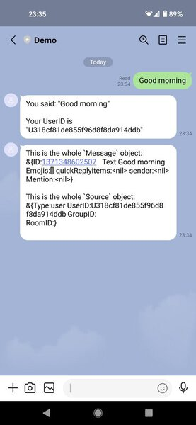

# Go Serverless LINE Bot Demo

This is a LINE Messaging Bot written in Go using the [LINE Messaging API SDK](https://github.com/LINE/LINE-bot-sdk-go). The bot provides a webhook to be called by LINE.

The bot is "serverless" which means it runs using AWS Lambda and uses AWS API Gateway to expose the webhook endpoint.

Deployment uses the [AWS Serverless Application Model](https://docs.aws.amazon.com/serverless-application-model/latest/developerguide/what-is-sam.html), with the [template](./aws-serverless/template.yml) and [config](./aws-serverless/samconfig.toml) provided.

Using this, you should be able to have a working LINE Bot up & running in less than 5 minutes. This demo bot will respond to any LINE text messages it receives with two reply messages: One echoing back the message text received and the sender's internal UserID, and the second with a dump (go's `%+v`) of the Message and Source objects received from LINE.

## Deployment using AWS SAM

### Prerequisites

You'll need:

 - `go` installed (version 1.16 or newer)
 - [AWS SAM CLI](https://docs.aws.amazon.com/serverless-application-model/latest/developerguide/serverless-sam-cli-install.html) installed
 - AWS CLI credentials set-up
 - Your "Channel Access Token" and "Channel Secret" for LINE Messaging API (get these from the LINE Developer Console)

### Deploying to AWS

*The `deploy.sh` script was tested on MacOS, and should work on Linux. You may need to adjust it if you are using Windows.*

 1. Execute `./aws-serverless/deploy.sh -g` 
 2. Enter parameter values when prompted:
   - `ChannelSecret` Your LINE API Channel Secret
   - `ChannelAccessToken ` Your LINE API Channel Access Token
   - Enter `Y` if asked "Function may not have authorization defined, Is this okay?"
   - Use the default values for the other parameters.
 3. When the stack has finished deploying, it will show the `WebhookUrl` value in the outputs section. Please set and enable this URL as your webhook URL in the LINE Developer console.

A full [deployment transcript](doc/deploy-transcript.txt) is in the `doc` directory and there are some screenshots below.

### Sanity check with `curl`

Making a HTTP POST request to the `WebhookUrl` address should produce a reply with `200` status and an empty body:

```
$ curl -d '' -isS https://xdosk33669.execute-api.us-west-2.amazonaws.com/v1/LINE/hook

HTTP/2 200 
content-type: application/json
content-length: 0
date: Sat, 13 Mar 2021 16:59:08 GMT
x-amzn-requestid: 71ce2272-98a5-9999-a526-72bbd14e9f65
...
```

## Screenshots


**Set & enable the webhook URL in the LINE Developer console:**


**Bot replies in the LINE app:**



## Notes

 - The LINE Messaging API SDK will validate the `X-Line-Signature` header when the webhook is called, to ensure only LINE can sucessfully use the webhook.